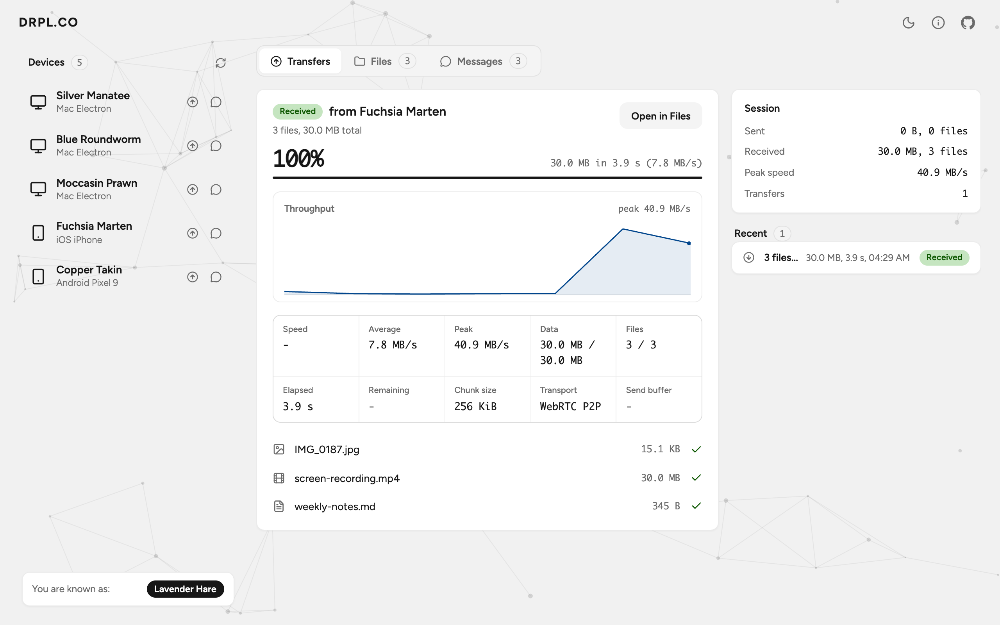
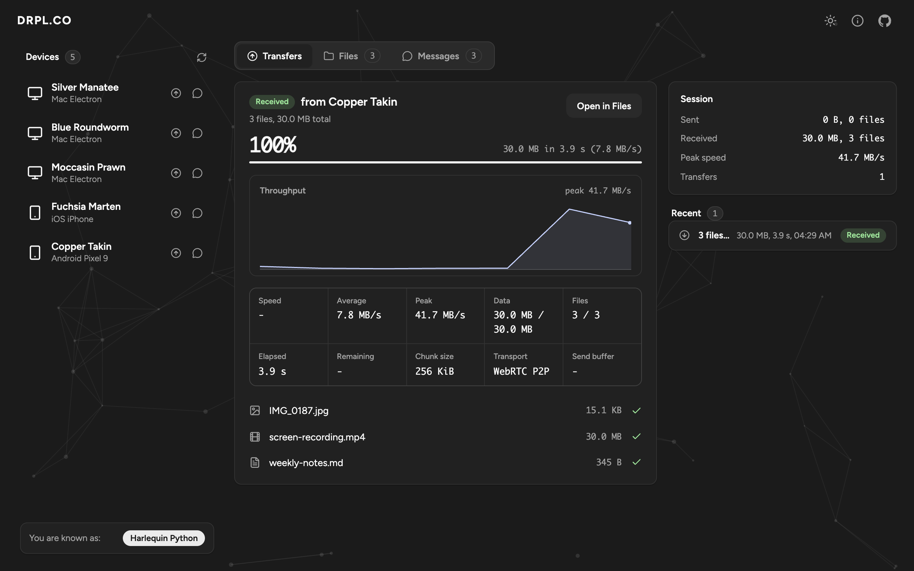
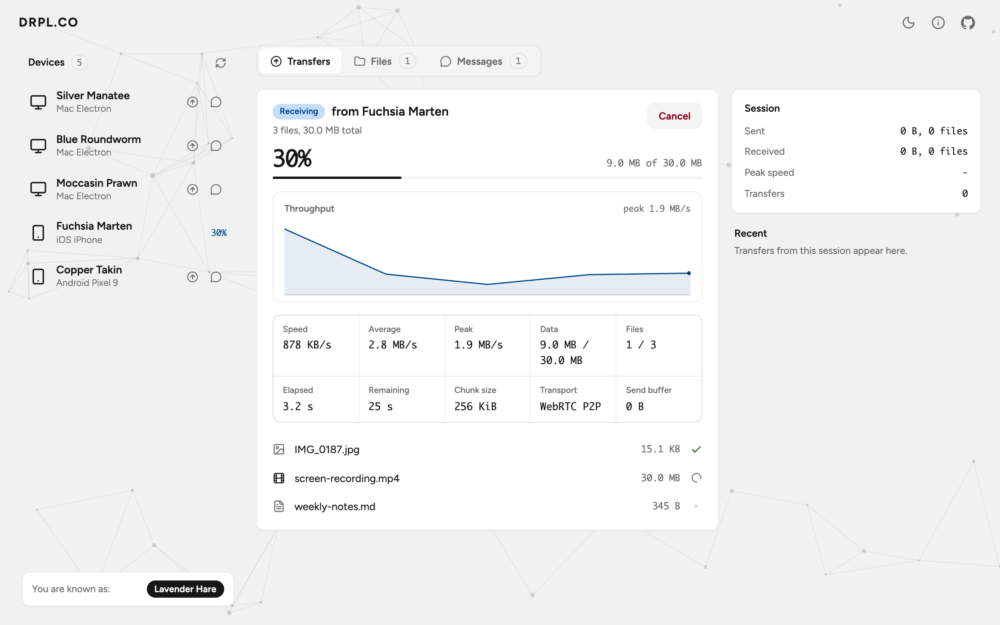
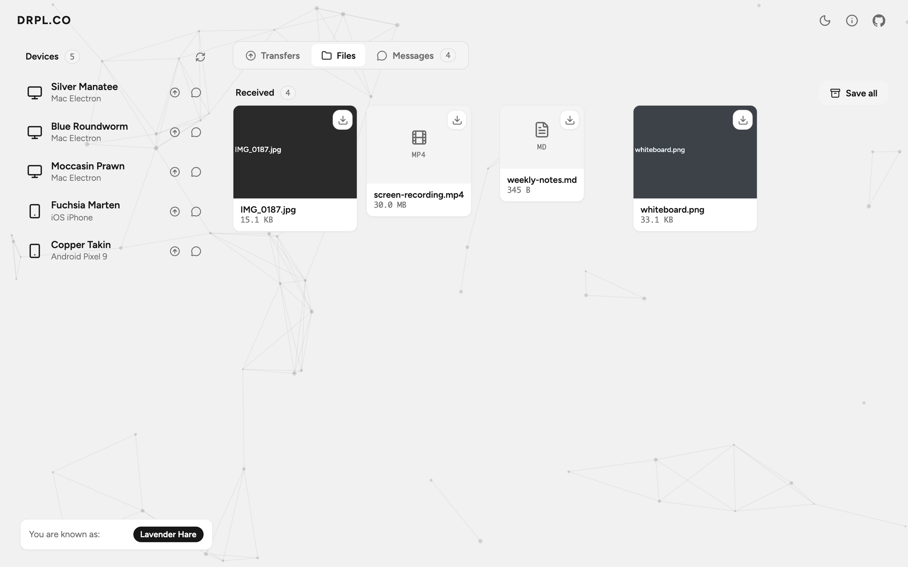
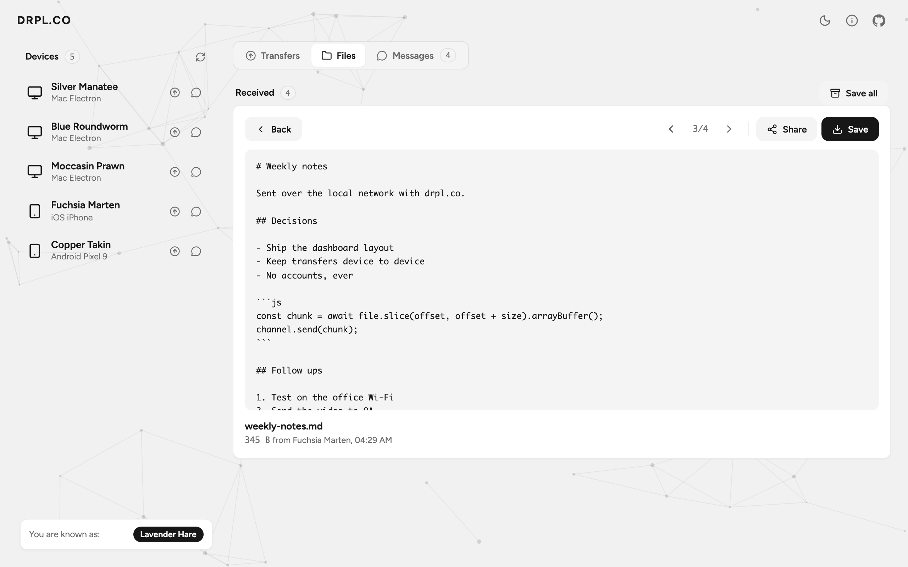
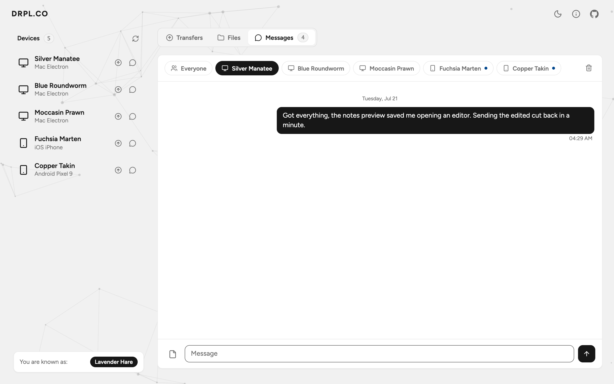
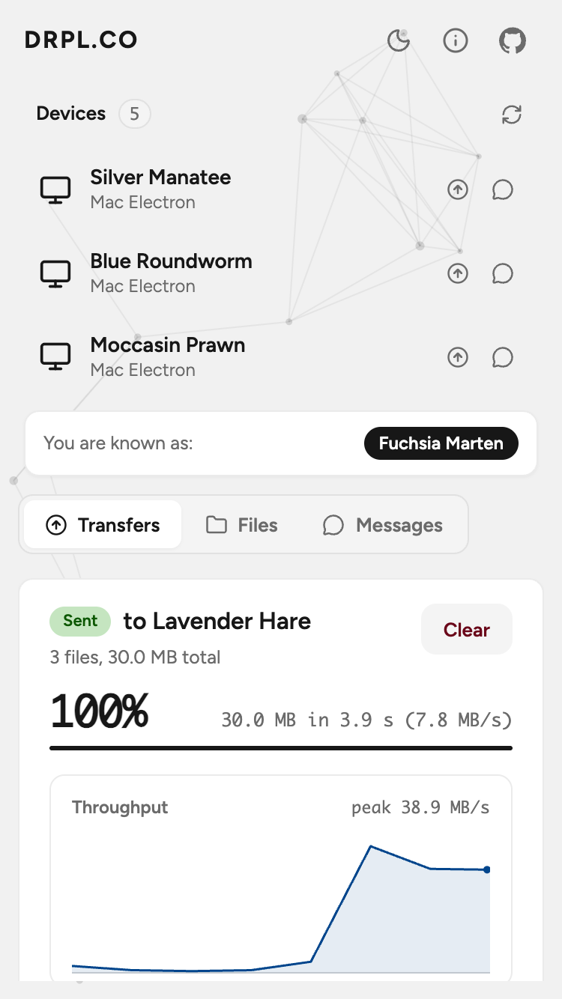

# drpl.co

<p align="center">
  <a href="https://github.com/MohdYahyaMahmodi/drpl.co/stargazers"></a>
  <a href="https://github.com/MohdYahyaMahmodi/drpl.co/network/members"></a>
  <a href="https://github.com/MohdYahyaMahmodi/drpl.co/issues"></a>
  <a href="https://github.com/MohdYahyaMahmodi/drpl.co/blob/main/LICENSE"></a>
  
</p>

Share files between devices on the same Wi-Fi, in the browser. No apps, no
accounts, no cloud. Open drpl.co on two devices, click one, pick files.
Transfers move directly from device to device over WebRTC, encrypted, and
never touch a server.

Live site: **[https://drpl.co](https://drpl.co)**

## Screenshots

Devices appear in the sidebar. Transfers run in the main area with a live
throughput chart and the transfer internals (chunk size, transport, send
buffer), all read from the real connection:

<p align="center">
  
</p>

Dark mode is an equal citizen:

<p align="center">
  
</p>

A transfer in flight:

<p align="center">
  
</p>

Everything received lands in the Files pane as a gallery, with image
thumbnails and one-click saving:

<p align="center">
  
</p>

Opening a file shows its preview. Text files (markdown, code, config, logs)
show their literal contents:

<p align="center">
  
</p>

Conversations combine text, links and the files you exchanged:

<p align="center">
  
</p>

<p align="center">
  
</p>

## Features

- **Automatic discovery**: devices on the same network see each other, no
  setup. Names are generated per tab, so two tabs are two devices.
- **Direct transfers**: WebRTC data channels with streaming backpressure
  and negotiated chunk sizes (64 to 256 KiB). Any file type, any count, no
  enforced size limit.
- **Live transfer detail**: per-file progress, a real throughput chart,
  speed/average/peak, elapsed and remaining time, chunk size, transport,
  and send buffer state.
- **Files gallery**: every received file in one place, with image
  thumbnails, one-click saving, image, video, audio and literal text
  previews, share sheet (where the platform supports sharing files), and
  zip export for batches.
- **Messages**: per-device conversations plus an Everyone group that
  reaches every device at once, including group file sends. Linkified
  text, inline images, and the transferred files shown in the timeline.
  Conversations persist in the browser (localStorage), never on a server.
- **Session panel**: totals for data sent and received, peak speed, and a
  history of this session's transfers.
- **Resilient connections**: the app survives sleep, tab switches, network
  blips and proxy idle timeouts, and reconnects itself. Transfers fail
  loudly with a reason instead of hanging.
- **Relay fallback**: when a firewall blocks WebRTC, transfers relay
  through the server (slower, but they work).
- **Light and dark themes**, a screen wake lock during transfers, desktop
  notifications while the tab is hidden, and a PWA with offline shell.

## How it works

1. A small Node.js server groups connected browsers by the public IP it
   sees. Devices behind the same router land in the same room and get each
   other's names. That is all the server knows: names, IPs and connection
   metadata. Never file contents.
2. Browsers negotiate a WebRTC data channel through the server (STUN via
   Google and Cloudflare, no TURN). On a shared Wi-Fi the channel connects
   directly between the devices, so bytes move at local network speed.
3. Files stream in chunks with backpressure
   (`bufferedamountlow`), and the receiver acknowledges each file. Both
   sides reach a terminal state: sent, received, or failed with a reason.
4. WebRTC data channels are DTLS-encrypted by the browser, always.

## Run it yourself

```bash
git clone https://github.com/MohdYahyaMahmodi/drpl.co.git
cd drpl.co
npm install
node server.js
```

Open `http://localhost:3002` (set `PORT` to change it). For other devices
on your network, use your machine's LAN address, e.g.
`http://192.168.1.20:3002`. Chrome may ask for local network permission on
plain-IP origins; HTTPS behind a reverse proxy is recommended for real use
(wss, wake lock, share sheet and notifications need a secure context).

Example nginx proxy:

```nginx
server {
    listen 443 ssl;
    server_name your-domain.com;

    ssl_certificate /path/to/fullchain.pem;
    ssl_certificate_key /path/to/privkey.pem;

    location / {
        proxy_pass http://localhost:3002;
        proxy_http_version 1.1;
        proxy_set_header Upgrade $http_upgrade;
        proxy_set_header Connection 'upgrade';
        proxy_set_header Host $host;
        proxy_set_header X-Forwarded-For $remote_addr;
        proxy_read_timeout 3600s;
    }
}
```

`X-Forwarded-For` matters: discovery groups devices by that address.

### Static hosting

`public/` is a fully static frontend. You can host it anywhere (GitHub
Pages included) and point it at a signaling server by editing one line in
`index.html`:

```js
window.DRPL_CONFIG = { signalingServer: "wss://your-server.example" };
```

Discovery always needs that one small server. A purely static page cannot
find LAN peers by itself with today's browser APIs; the research notes in
[RESEARCH.md](RESEARCH.md) cover the alternatives and what they cost.

## Tech

- Vanilla HTML, CSS and JavaScript. No framework, no build step.
- Node.js signaling server (`express`, `ws`, `ua-parser-js`,
  `unique-names-generator`).
- Pinned, optional CDN libraries: GSAP 3.15.0 for animation, Toastify-js
  1.12.0 for toasts, JSZip 3.10.1 loaded only when zipping. The app works
  with every CDN blocked.
- Lucide icons inlined as an SVG sprite; Figtree as a 20 KB self-hosted
  variable font.
- Design tokens are transcribed values from Meta's open-source
  [Astryx](https://github.com/facebook/astryx) neutral theme (MIT), with
  the design rules documented in [design-system.md](design-system.md) and
  [ai-generated-ui-things-to-avoid.md](ai-generated-ui-things-to-avoid.md).

## Project structure

```
server.js                       signaling server (discovery + relay)
public/
  index.html                    markup, icon sprite, config
  scripts/network.js            transports and transfer protocol
  scripts/ui.js                 dashboard (Transfers / Files / Messages)
  scripts/theme.js              theme switching
  scripts/background-animation.js
  scripts/notifications.js      desktop notifications
  scripts/sw.js                 service worker
  styles/styles.css             design tokens and all styling
  fonts/, images/, manifest.json, offline.html
```

## Browser support

Evergreen Chrome, Edge, Firefox and Safari, on Windows, macOS, Linux,
Android and iOS (15+). If WebRTC is blocked, the relay fallback keeps
transfers working.

## Contributing

Issues and pull requests are welcome. Before UI changes, read
[ai-generated-ui-things-to-avoid.md](ai-generated-ui-things-to-avoid.md)
and [design-system.md](design-system.md); before protocol changes, read
[RESEARCH.md](RESEARCH.md). Keep the frontend vanilla and dependency-free.

## License

MIT. See [LICENSE](LICENSE).

## Author

**Mohd Yahya Mahmodi**

- Website: [mohdmahmodi.com](https://mohdmahmodi.com)
- X: [@mohdmahmodi](https://x.com/mohdmahmodi)
- Email: mohdmahmodi@pm.me

## Acknowledgments

- [Snapdrop](https://github.com/SnapDrop/snapdrop) by Robin Linus, the
  original browser AirDrop, and [PairDrop](https://github.com/schlagmichdoch/PairDrop),
  its actively maintained successor. drpl.co shares their discovery model
  and rethinks the transfer protocol and interface.
- [Lucide](https://lucide.dev) (ISC), [GSAP](https://gsap.com),
  [Toastify-js](https://github.com/apvarun/toastify-js) (MIT),
  [Figtree](https://github.com/erikdkennedy/figtree) (OFL), and
  [Astryx](https://github.com/facebook/astryx) (MIT) token values.
